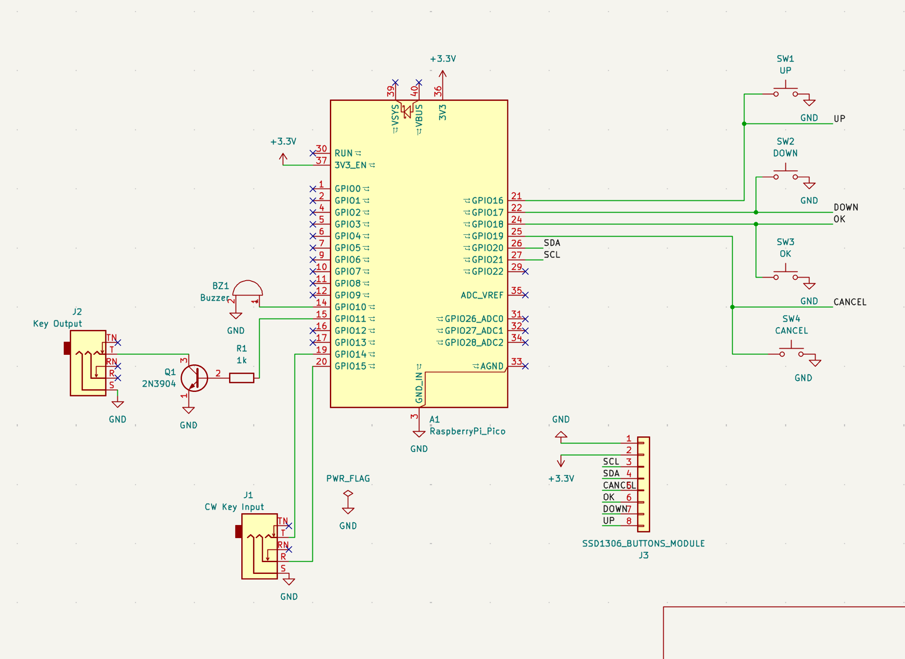

# rp-keyer

RP2040 / RP2350 firmware that turns a Raspberry Pi Pico (or Pico 2) into a
self-contained CW (Morse) keyer with:

* iambic / straight / bug / ultimatic / single-paddle keyer engine from
  [`radio-utils-keyer`](https://crates.io/crates/radio-utils-keyer),
* on-device CW decoder from
  [`radio-utils-cw-decoder`](https://crates.io/crates/radio-utils-cw-decoder)
  feeding the OLED decoded-text row,
* USB MIDI + USB CDC SERIAL_STATE paddle interface (same wire contract
  as [cw-adapter](https://github.com/sp5tls/cw-adapter)),
* PWM-driven passive piezo buzzer for sidetone,
* 2N2222 NPN driver to key a real radio,
* SSD1306 128×64 OLED + 4-button menu for keyer settings.

## Pinout (default for both Pico / Pico 2)

Pins are grouped into two physical clusters on the Pico header so wiring
stays tidy whether you fly leads or build a PCB.

**Left edge — keyer hardware:**

| Function          | Pin | GPIO | Notes                                        |
|-------------------|-----|------|----------------------------------------------|
| Buzzer / GND      | 13  | GND  | Shared with radio-key return                 |
| Buzzer            | 14  | GP10 | PWM5A, drives passive piezo                  |
| Radio key out     | 15  | GP11 | Drives 2N2222 base via 1 kΩ resistor         |
| Paddle GND        | 18  | GND  | TRS sleeve                                   |
| Dit paddle        | 19  | GP14 | TRS tip, active-low, internal pull-up        |
| Dah paddle        | 20  | GP15 | TRS ring, active-low, internal pull-up       |

**Right edge — OLED + 4-button combo module (single 8-wire connector):**

| Module pin | Pico pin | GPIO  | Function                            |
|------------|----------|-------|-------------------------------------|
| K1         | 21       | GP16  | Button UP   (top of stack)          |
| K2         | 22       | GP17  | Button DOWN                         |
| GND        | 23       | GND   | Module ground                       |
| K3         | 24       | GP18  | Button OK                           |
| K4         | 25       | GP19  | Button BACK (bottom of stack)       |
| SDA        | 26       | GP20  | I2C0 SDA                            |
| SCL        | 27       | GP21  | I2C0 SCL                            |
| VCC        | 36       | 3V3   | Single jumper to 3V3 OUT            |

All eight module wires land on the same edge of the Pico — seven on the
contiguous right-side strip (pins 21–27) plus one jumper to 3V3.

## Radio key wiring

```
   GP11 ─── 1 kΩ ──── Base
                       │
                    2N2222 NPN
                       │
                    ┌──┴──┐
                    │     │
               Collector  Emitter
                    │     │
   radio key tip ───┘     └─── GND ─── radio key sleeve
   (or PTT)
```

Connections:

* **Base** ← GP11 through the 1 kΩ current-limiting resistor.
* **Collector** ← radio key tip (or PTT line). The radio's keying
  supply provides the pull-up; the 2N2222 sinks this line to ground
  when GP11 is high.
* **Emitter** → GND, shared with the radio key sleeve so the
  firmware and the radio agree on ground reference.

Drop a flyback diode across the collector–emitter (cathode to
collector) if your radio's key line is inductive.

The schematic uses a **2N3904** in this position; a **2N2222** is a
drop-in substitute — both are general-purpose NPN signal transistors
with more than enough current capacity for keying a typical radio.

## Schematics

A KiCad 8 project for the reference carrier board lives under
[`schematics/rp-keyer/`](schematics/rp-keyer/). It contains:

* `rp-keyer1.kicad_pro` — project file (open this in KiCad)
* `rp-keyer1.kicad_sch` — schematic
* `rp-keyer1.kicad_pcb` — PCB layout



The schematic captures the pinout above 1:1: paddle TRS jack `J1` on
GP14/GP15, radio-key TRS jack `J2` driven through Q1+R1 from GP11,
buzzer `BZ1` on GP10, and the 8-pin `SSD1306_BUTTONS_MODULE` connector
`J3` carrying SDA/SCL plus K1..K4 to GP16..GP21 with 3V3 + GND from the
top of the Pico.

## Pre-built firmware

Each tagged release publishes ready-to-flash `.uf2` files for both
boards on the [GitHub Releases page](https://github.com/sp5tls/rp-keyer/releases).
Hold BOOTSEL while plugging the board in, then drag the `.uf2` onto the
USB drive that appears.

## Building from source

```sh
# RP2040 (Pico)
cargo build --release \
  --target thumbv6m-none-eabi \
  --features rp2040,serial,midi \
  --bin rp2040

# RP2350 (Pico 2)
cargo build --release \
  --target thumbv8m.main-none-eabihf \
  --features rp2350,serial,midi \
  --bin rp2350
```

Generate a `.uf2` from the ELF:

```sh
cargo install elf2uf2-rs

elf2uf2-rs target/thumbv6m-none-eabi/release/rp2040 rp-keyer-rp2040.uf2
# For RP2350: elf2uf2-rs hardcodes the RP2040 family ID, so rewrite it
# afterwards or the Pico 2 BOOTSEL drive will reject the file.
elf2uf2-rs target/thumbv8m.main-none-eabihf/release/rp2350 rp-keyer-rp2350.uf2
python3 scripts/patch_uf2_family.py rp-keyer-rp2350.uf2
```

Flashing via `probe-rs`:

```sh
cargo run --release \
  --target thumbv6m-none-eabi \
  --features rp2040,serial,midi \
  --bin rp2040
```

## Menu

Boot screen shows the live mode / WPM / sidetone frequency.  `OK` enters
the settings list; `UP`/`DOWN` scroll, `OK` enters an item for editing,
`UP`/`DOWN` change the value, `OK` / `BACK` return.

Settable parameters:

* Mode (Straight / IambicA / IambicB / Bug / Ultimatic / SinglePaddle)
* WPM (5 – 60)
* Weight (25 – 75)
* Sidetone frequency (300 – 1200 Hz)
* Sidetone volume (0 – 100 %)
* Hang time (0 – 2000 ms)
* Keys reversed (Y / N)
* Iambic-B CMOS timing percentage (0 – 100)
* Farnsworth WPM (0 – 60, 0 = off)
* Keying compensation (0 – 50 ms)

## License

Dual-licensed under either of:

- [MIT license](LICENSE-MIT)
- [Apache License, Version 2.0](LICENSE-APACHE)

at your option.
